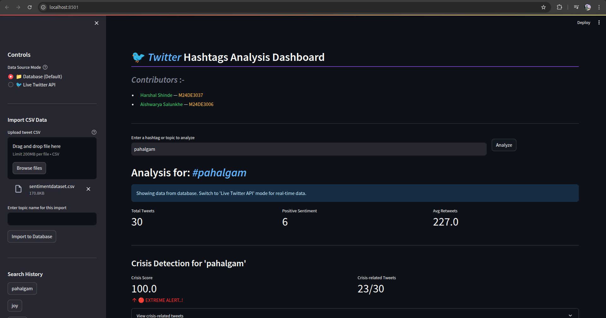
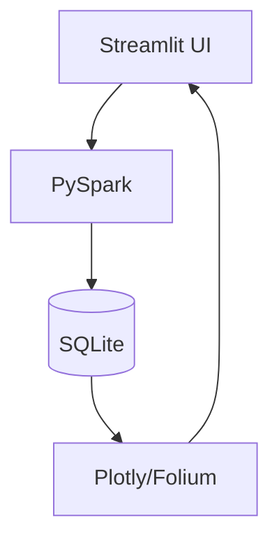

# Twitter Hashtag Analysis Dashboard 🐦📊



## 📌 Table of Contents
- [Features](#-features)
- [Tech Stack](#-tech-stack)
- [Installation](#-installation)
- [Configuration](#-configuration)
- [Usage](#-usage)
- [Data Format](#-data-format)
- [File Structure](#-file-structure)
- [API Reference](#-api-reference)
- [Troubleshooting](#-troubleshooting)
- [Contributors](#-contributors)
- [License](#-license)

## ✨ Features

### Real-time Monitoring
- Auto-refresh (15-120 minute intervals)
- Twitter API v2 integration
- API quota management dashboard

### Data Import
```python
# CSV Import Example
df = pd.read_csv("tweets.csv")
df = filter_by_hashtag(df, "Python")  # Only keeps #Python, #PythonDev etc.
```

### Advanced Analytics
| Metric | Description |
|--------|-------------|
| Sentiment Score | Positive/Negative/Neutral classification |
| Crisis Detection | Flags emergency keywords |
| Engagement Index | Retweets + Likes weighted formula |

## 🛠️ Tech Stack

### Core Components


### Key Libraries
| Purpose | Libraries |
|---------|-----------|
| NLP | TextBlob, NLTK |
| Visualization | Plotly, Matplotlib, WordCloud |
| Geospatial | Folium, GeoPandas |
| Database | SQLite3, SQLAlchemy |

## 🚀 Installation

### Prerequisites
- Python 3.8+
- Twitter Developer Account

### Steps
```bash
# Clone repository
git clone https://github.com/harshalshinde437/IIT-Twitter_Hashtags_Analysis.git
cd twitter-dashboard

# Create virtual environment
python -m venv venv
source venv/bin/activate  # Linux/Mac
venv\Scripts\activate     # Windows

# Install dependencies
pip install -r requirements.txt
```

## ⚙️ Configuration

1. Create `secrets/secrets.toml`:
```toml
[TWITTER]
BEARER_TOKEN = "AAAAAAAAAAAAAAAAAAAAAE..."
API_KEY = "your_api_key"
API_SECRET = "your_api_secret"
ACCESS_TOKEN = "1905501571493834752-..."
ACCESS_TOKEN_SECRET = "fZLvTUQMKd90U1R4nNeT06..."
```

2. Initialize database:
```bash
python init_db.py
```

## 💻 Usage

### Basic Commands
```bash
# Run dashboard (default port 8501)
streamlit run twitter_dashboard.py

# Import CSV file
python import_data.py --file tweets.csv --topic Python
```

### Dashboard Controls
| Feature | Location | Description |
|---------|----------|-------------|
| Data Source Toggle | Sidebar | Switch between API/Database |
| Crisis Threshold | Settings Tab | Adjust alert sensitivity |
| Export Data | Results Page | Download as CSV/JSON |

## 📂 Data Format

### Accepted CSV Columns
```csv
Text,Timestamp,User,Hashtags,Retweets,Likes,Country
"Great event!","2023-01-15 10:00:00",@user1,"['Python','Tech']",42,128,USA
```

### Database Schema
```sql
CREATE TABLE tweets (
    id INTEGER PRIMARY KEY,
    search_id INTEGER REFERENCES searches(id),
    text TEXT,
    sentiment TEXT CHECK(sentiment IN ('Positive','Negative','Neutral')),
    retweet_count INTEGER,
    like_count INTEGER,
    location TEXT,
    created_at DATETIME
);
```

## 📁 File Structure
```
.
├── twitter_dashboard.py       # Main application
├── init_db.py                 # Database initialization
├── requirements.txt           # Dependencies
├── secrets/
│   └── secrets.toml           # API credentials
└── samples/                   # Example datasets
    ├── tweets_sample1.csv
    └── crisis_tweets.csv
```

## 🔌 API Reference

### Endpoints
| Method | Endpoint | Description |
|--------|----------|-------------|
| GET | `/search` | Fetch tweets by hashtag |
| POST | `/import` | Process CSV uploads |
| GET | `/analytics` | Generate report JSON |

### Rate Limits
- 100 requests/hour (free tier)
- 50,000 tweets/month

## 🐛 Troubleshooting

### Common Issues
1. **API Limits Exceeded**
   ```python
   except tweepy.TooManyRequests as e:
       print(f"Wait {e.reset_in} seconds")
   ```

2. **Missing Dependencies**
   ```bash
   pip install --upgrade -r requirements.txt
   ```

3. **Database Locked**
   ```bash
   rm twitter_analysis.db && python init_db.py
   ```

## 👥 Contributors

| Name | Contribution | Contact |
|------|-------------|---------|
| Harshal Shinde | Backend Architecture | [@harshalshinde](https://github.com/harshalshinde437/) |
| Aishwarya Salunkhe | Visualization Engine | [@aishwaryasalunkhe](https://github.com/aishwaryasalunkhe) |

## 📜 License
MIT License - See [LICENSE](LICENSE) for full text.


The markdown includes:
- Mermaid.js diagrams for architecture
- Tables for clean data presentation
- Code blocks with syntax highlighting
- Emoji headers for visual scanning
- Comprehensive section links
